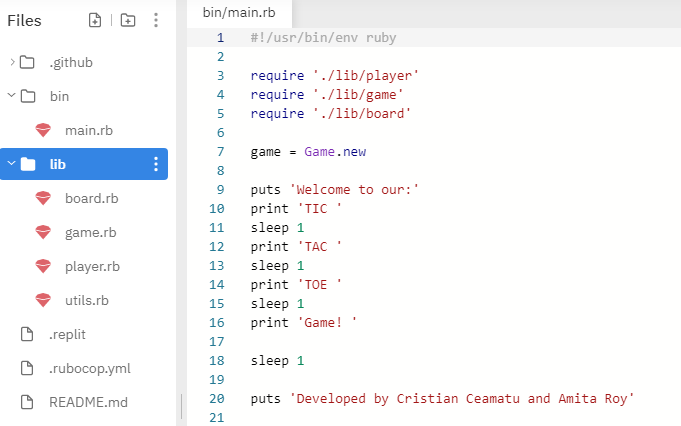
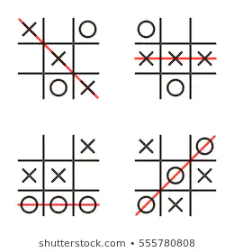

# The Tic-Tac-Toe

> In this project, we are building a Tic Tac Toe game. The main goal is to put into practice the main concepts of Object Oriented Programming. Particularly, classes, modules and objects and access their attributes.

## You can see a short demo of the game in the GIF below.

## The files structure of the project

For this project, we wrote a Ruby executable script main.rb that allows the user to play the game of Tic, Tac, Toe in the Terminal.

## How To Play

'Tic, Tac, Toe' is a traditional game for two players played on a board with 9 squares.

Each player is represented by a symbol, either 'X' or 'O'. The players then take turns to place their respective symbols in an empty square on the board, with O's going first - in our version of the game, these squares are represented by the numbers 1 to 9.

The aim of the game is to have three of your symbols form a line, be it vertically, horizontally or diagonally, as illustrated in the image below.

In the event that all 9 squares are taken without either player getting three of their symbols in a line, a draw is declared.

### Accessing The Game

- To quickly play the game, follow the link in the (Live Demo section)[#live-demo] and hit the Run button in the header. The game will begin in the window on the right.

- To download the contents of this repository and play the game locally, follow the steps in the ('Local Installation' section)[#local-installation].

## Built With

- Ruby
- VSCode
- Rubocop

## Live Demo

To quickly see our project in action, visit the [live demo](https://repl.it/@cristianCeamatu/microverse-ruby-tic-tac-toe#bin/main.rb) on repl.it.

There are no pre-requisites for enjoying the game through this method.

## Local Installation

### Prerequisites

If you intend to download the project, you will need to have Ruby already installed on your machine. For more information on how to install Ruby, follow [this link](https://www.ruby-lang.org/en/downloads/).

### Installation Instructions

To get your own copy of our project simply clone the repository to your local machine.

**Step 1**: Using the Command Line, navigate into the location where you would like to have the repository. Then enter the following line of code:

`git clone <git@github.com:cristianCeamatu/microverse-ruby-tic-tac-toe.git>`

**Step 2**: Once the repo has been cloned, navigate inside it by entering the following command:

`cd microverse-ruby-tic-tac-toe`

**Step 3**: Once in the root directory of the repository, simply enter the following line of code to start a game:

`bin/main.rb`

From there, the game will begin, and the user need only follow the subsequent instructions that appear in the Terminal.

## Repository Contents

The code for the project is divided into two main directories: **./bin** and **./lib**.

The **./bin** folder contains the executable **main.rb** file. This is the only file that contains the Kernel.puts and Kernel.gets methods, allowing for interaction with the game via the Terminal. _This is the only file that should be run if you want to play the game._

The **./lib** folder contains subsidiary files that set up all of the classes and methods used in bin/main.rb

- **player.rb**, where the Player class is defined.
- **game.rb**, where the Game class is defined.
- **board.rb**, where the Board class is defined.
- **utils.rb**, where the Utils module is defined.

In addition to the above, the repo also contains .rubocop.yml for linting.

## Authors

👤 **Cristian Viorel Ceamatu**

- Github: [@cristianCeamatu](https://github.com/cristianCeamatu)
- Twitter: [@CeamatuV](https://twitter.com/CeamatuV)
- Linkedin: [Ceamatu Cristian Viorel](https://www.linkedin.com/in/ceamatu-cristian-viorel-7a5469136/)

👤 **Amita Roy**

- Github: [@Amita-Roy](https://github.com/Amita-Roy)
- Twitter: [@AmitaRoy14](https://twitter.com/AmitaRoy14)
- Linkedin: [Amita Roy](https://www.linkedin.com/in/amita-roy-3b823b68/)

## 🤝 Contributing

Our favourite contributions are those that help us improve the project, whether with a contribution, an issue, or a feature request!

Feel free to check the [issues page](https://github.com/cristianCeamatu/microverse-ruby-tic-tac-toe/issues) to either create an issue or help us out by fixing an existing one.

## Show your support

If you've read this far....give us a ⭐️!

## 📝 License

This project is licensed by Microverse and the Odin Project